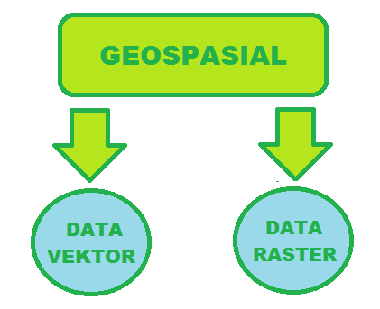
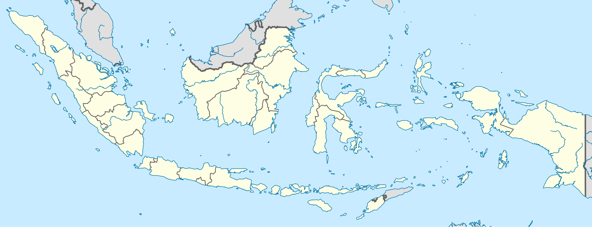
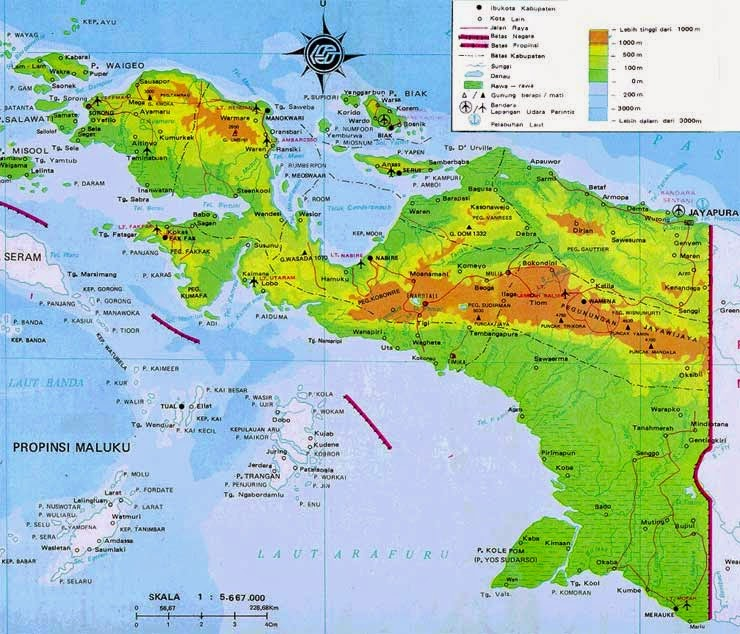

<h2 align="center">Data Geospasial</h2>
 
<strong>Latar Belakang:</strong>
 
1.Apa itu geospasial? 
2.Apa itu Data Vektor? 
3.Apa itu Data Raster? 
4.Apa Aplikasi yang digunakan? 

  

<strong>Isi:</strong>
 
&nsbp;&nsbp;&nsbp;&nsbp;Data Geospasial itu merupakan data yang melingkupi bumi,nah geospasial itu dibagi jadi dua yaitu Data Vektor dan Data Raster.
 
&nsbp;&nsbp;&nsbp;&nsbp;Yang pertama adalah Data Vektor,Data ini berisi data titik kordinat atau kumpulan titik,jadi bisa diumpamain sebuah titik kemudian garis(kumpulan titik) dan polygon(kumpulan garis).Data Vektor itu dibagi 2 loh,yaitu:
 
&nsbp;&nsbp;&nsbp;&nsbp;1.Cultural yaitu adalah data vektor yang dipengaruhi oleh peradaban,contohnya adalah:Batas wilayah,batas kota,Batas negara,Batas provinsi,dll.
 
&nsbp;&nsbp;&nsbp;&nsbp;2.Physical yaitu adalah data yang terlihat di muka bumi,contohnya adalah:Pulau,Laut,Garis pantai,Benua,dll.
 

  

 

Pada gambar diatas anda bisa fokus kepada garis hitam yang menunjukkan batas wilayah atau negara,nah itulah yang dinamakan dengan Data Vektor.

 

&nsbp;&nsbp;&nsbp;&nsbp;Yang kedua adalah Data Raster,data ini adalah data gambar permukaan bumi,data gambarnya diperoleh dari perekaman foto radar/satelit.Data Raster ini biasanya adalah tampak permukaan bumi yang debedakan warna,contohnya pada peta ada yang diwanai hijau,kuning,biru,dll.
 

  

 
Jika anda ingin mempelajari tentang Sistem Informasi Geografis khususnya data geospasial ini anda dapat menggunakan aplikasi QGIS ,dan datanya anda bisa mendownload di Natural Earth.

 

<strong>Penutup</strong> 
<strong>Kesimpulan:</strong> 
&nsbp;&nsbp;&nsbp;&nsbp;Data Geospasial itu merupakan data yang melingkupi bumi,data geospasial itu dibagi jadi dua yaitu Data Vektor dan Data Raster.Data Vektor berisi data titik kordinat atau kumpulan titik,sedangkan Data Raster adalah data gambar permukaan bumi.
<strong>Saran:</strong> 
&nsbp;&nsbp;&nsbp;&nsbp;Sebaiknya jika ingin memperdalam tentang geospasial ini alangkah baiknya langsung menggunakan aplikasi seperti QGIS dengan begitu anda bisa lebih membedakan mana itu data vektor dan mana itu data raster.

